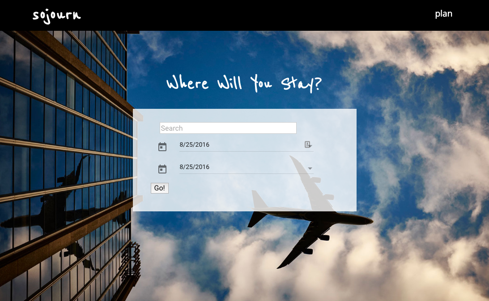

# Sojourn Travel App
WDI group project by Ben Brizzi, Megan Coyle, and Taylor Edwards

## Overview
Sojourn is a travel app to help users plan their trips.

## Deployed App

[View Sojourn](https://sojourn-travel.herokuapp.com)

## Technologies Used
* [Angular JS](https://angularjs.org/): front-end
* [Ruby on Rails](http://rubyonrails.org/): back-end
* [Angular Material](https://material.angularjs.org/latest/): calendar picker and tabs
* [Bower](https://bower.io/): package manager
* [Google Maps Angular API](http://angular-ui.github.io/angular-google-maps/)

## User Stories
[Check out the user stories here](planning/user_stories.md)
